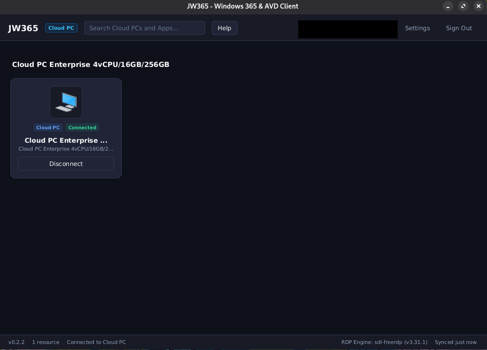
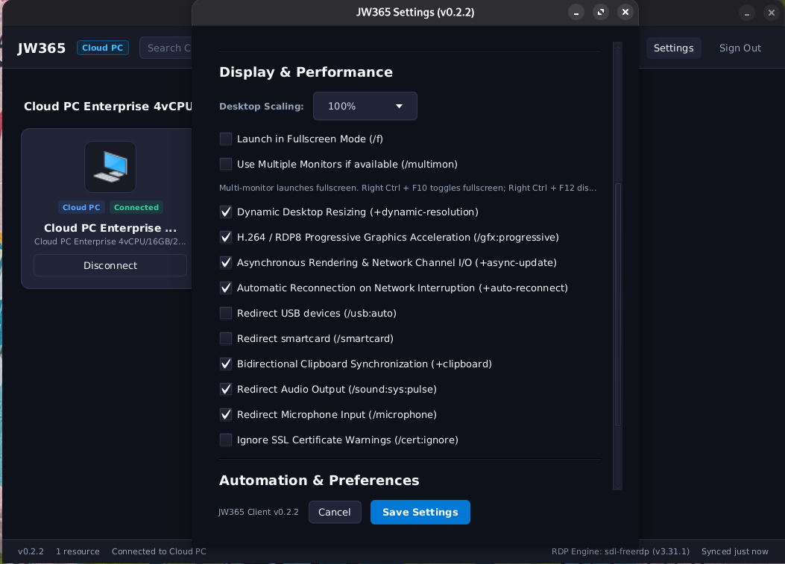

# JW365 - Windows 365 & AVD Linux Client

Native desktop client for Linux to connect to Microsoft Windows 365 Cloud PCs and Azure Virtual Desktop workspaces.



## Features

- **Embedded Entra ID Authentication**: Direct Microsoft work/school account sign-in via embedded WebView with OAuth 2.0 PKCE.
- **Silent Session Re-auth**: Injects session identity into FreeRDP `/sec:aad` token requests with encrypted, machine-bound cookie persistence.
- **Optimized FreeRDP 3 Engine**: H.264 video decoding (`/gfx:AVC420,progressive`), RemoteFX (`+rfx`), software GDI compositing, and VSync enabled by default to prevent tearing and flicker.
- **Dynamic Resolution & Multi-Monitor**: Automatically adapts remote resolution to Linux window size; supports multi-monitor spanning and fullscreen modes.
- **Audio & Peripheral Redirection**: PulseAudio/PipeWire 48kHz audio output and microphone input, clipboard synchronization, smartcard redirection.
- **Self-Contained Packages**: Bundled Java 25 runtime image via `jlink`. No local JRE installation required. Available as Flatpak, `.deb`, `.rpm`, and portable `.tar.gz`.



---

## Installation

Download packages from the **[GitHub Releases](https://github.com/alaurie/JW365/releases)** page.

### Flatpak (Recommended)

Flatpak bundle bundles FreeRDP 3.31+ and requires no system dependencies:

```bash
flatpak install --user build/distributions/jw365.flatpak
flatpak run io.github.alaurie.JW365
```

### Ubuntu / Debian (`.deb`)

```bash
sudo apt install ./jw365_*_amd64.deb
```

### Fedora / RHEL (`.rpm`)

```bash
sudo dnf install ./jw365-*.x86_64.rpm
```

### Portable Tarball (`.tar.gz`)

```bash
tar -xzf jw365-*-linux-x64.tar.gz
cd jw365

# Optional: register desktop launcher and icon
./install-desktop.sh

# Run directly
./bin/jw365
```

---

## Prerequisites (Native Packages Only)

The Flatpak package includes its own FreeRDP engine. If using `.deb`, `.rpm`, or `.tar.gz`, install FreeRDP 3:

```bash
# Ubuntu / Debian
sudo apt update && sudo apt install freerdp3-sdl freerdp3-x11

# Fedora
sudo dnf install freerdp

# Arch Linux
sudo pacman -S freerdp
```

You can also use Flathub's FreeRDP:
```bash
flatpak install --user flathub com.freerdp.FreeRDP
```
In **Settings > FreeRDP Client Engine**, choose between system, Flatpak, or custom binaries.
### Shortcuts (SDL FreeRDP)

FreeRDP uses `Right Ctrl` as the local client modifier key:

- **Right Ctrl + Return**: Toggle fullscreen
- **Right Ctrl + M**: Minimize window
- **Right Ctrl + D**: Disconnect session
- **Right Ctrl + G**: Toggle keyboard and mouse grab
- **Right Ctrl + R**: Toggle resizable window

*(The modifier was remapped from Right Shift to Right Control so typing capital letters like G and D does not trigger local shortcuts).*
## Architecture

- **Runtime**: Java 25 (`jlink` minimal image, ~90 MB).
- **UI Toolkit**: OpenJFX 25 (JavaFX) with custom dark stylesheet.
- **Concurrency**: Loom Virtual Threads for workspace discovery, feed parsing, and FreeRDP output streaming.
- **Session Auth**: Intercepts FreeRDP AAD token requests on stdout, authenticates silently in WebView, and feeds redirect codes to FreeRDP over a PTY.
- **Token Storage**: AES-256-GCM encrypted local store keyed to host machine ID and user identity (`0600` permissions), with Secret Service (`secret-tool`) fallback.
- **Resource Tuning**: Serial GC (`-XX:+UseSerialGC`) with aggressive heap uncommit bounds (`-Xms24m -Xmx192m`).

---

## Building from Source

Requirements: JDK 25, Linux x86_64.

```bash
# Run unit & integration test suite (55 tests)
./gradlew test

# Run application in dev mode
./gradlew run

# Build release packages (outputs to build/distributions/)
./gradlew packageDeb
./gradlew packageRpm
./gradlew packagePortableTar

# Build Flatpak bundle
./gradlew flatpakBuild flatpakBundle
```

---

## License

Apache License 2.0. See [LICENSE](LICENSE) for details.
